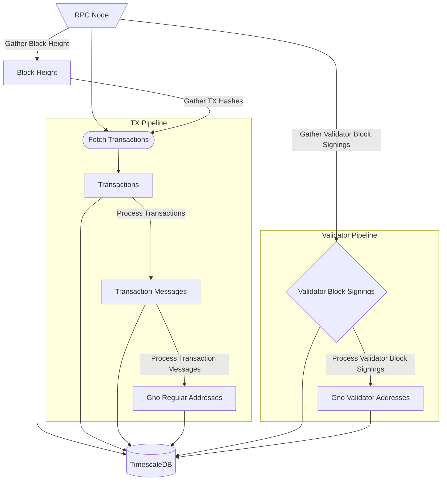
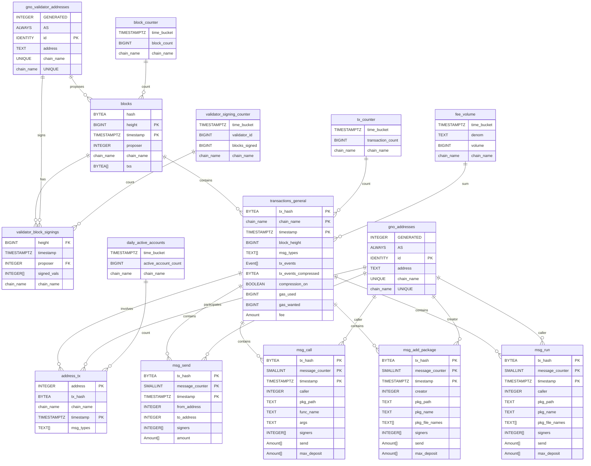
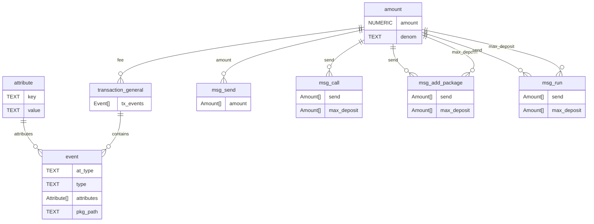

# Database data model and schema

This file will outline how the data is gathered, stored and processed by the indexer.

## Data flow from the RPC node

The indexer will connect to the RPC node and will start to gather the data from the node.
It collects and processes data by using batch processing. For live mode the indexer will collect the data up to the
latest block height and then it will process it in batches.

The data is gathered in the following way:

First the indexer gathers block data and validator signing for those blocks. If there are transactions the
tx hashes are gathered from the block height data and are queried from the RPC. At that moment the transaction
data is gathered and processes and all of the transaction general data and messages contained in the transaction
are stored in the database. The regular and validator addresses are processed in that way that the addresses are
stored as unique int32 ids and then referenced by the integer value in the transaction tables.

## Database schema

And custom types:

